# 30DayChartChallenge2023

Participación en #30DayChartChallenge 2023 (ver: https://twitter.com/30DayChartChall).

- En la carpeta "R" encuentras los script de los gráficos subidos según día.

- En la carpeta "input" puedes encontrar las bases de datos, a menos que éstas sean públicas. De ser así en el script encontrarás un link a ellas.

- En la carpeta "output" encuentras las imágenes de los gráficos.

Equipo [DESUC](http://sociologia.uc.cl/desuc/quienes-somos-desuc/)

Nuestro blog [aquí](https://blog.desuc.cl/) y lo que hacemos [aquí](https://blog.desuc.cl/incidencia.html)

### Día 1: Part-to-whole 

Este tipo de gráficos que se engloban en los "part-to-whole" permiten mostrar partes dentro de una variable. Aquí quisimos mostrar datos de felicidad para Chile desde World Values Survey.

- Datos para la elaboración del gráfico disponibles [aquí](https://ourworldindata.org/happiness-and-life-satisfaction)
- Código disponible [aquí](/R/01-part-to-whole.R)

Autoría Cristina Marchant.

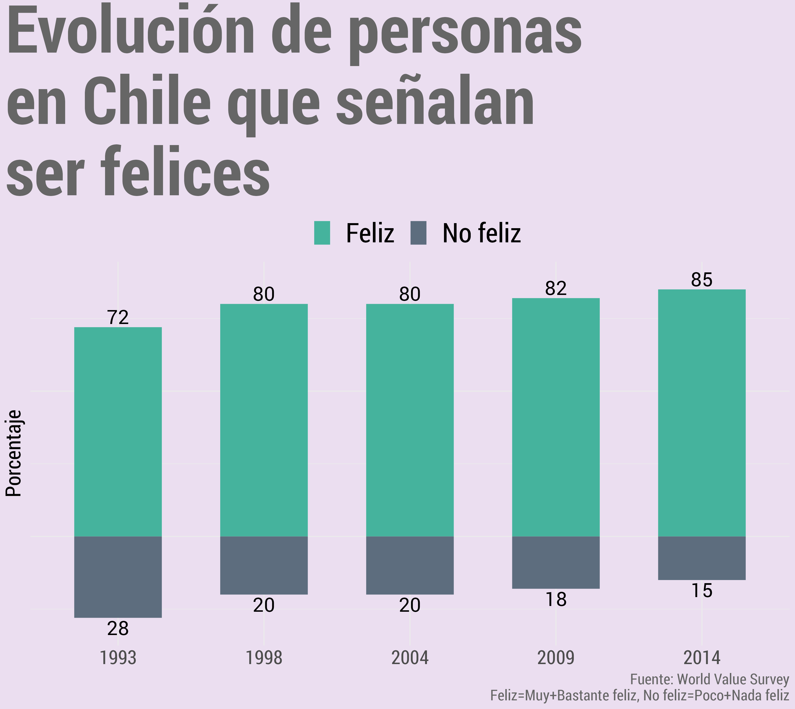

### Día 2: waffle 

Este tipo de gráficos permiten mostrar mediante un pictograma la distribución de ciertos datos. Aquí quisimos mostrar información respecto del envejecimiento poblacional en Chile.

- Datos para la elaboración del gráfico disponibles [aquí](https://ourworldindata.org/age-structure)
- Código disponible [aquí](/R/02-waffle.R)

Autoría Cristina Marchant.

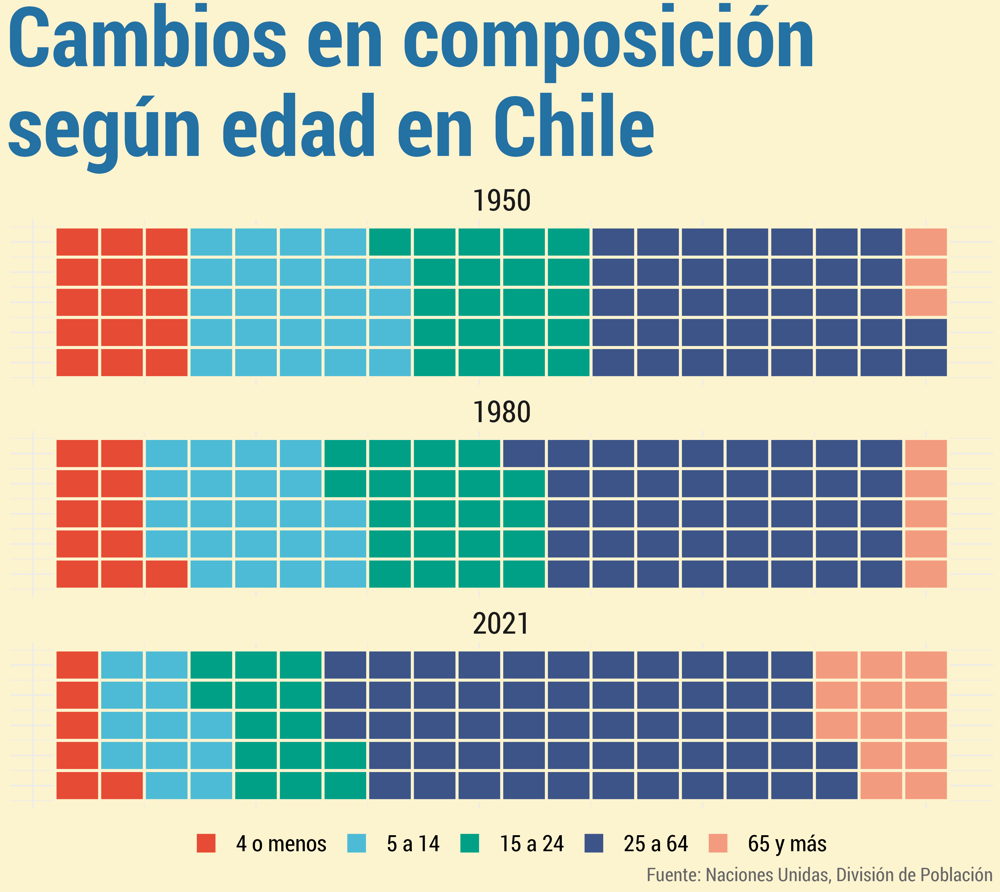

### Día 3: Fauna/flora

En este gráfico se utilizaron datos del Sistema de Información Digital para el Control de Operaciones de CONAF, con el fin de observar las hectáreas afectadas por incendios forestales en Chile.

- Datos para la elaboración del gráfico disponibles [aquí](/input/incendios_forestales_2023.csv)
- Código disponible [aquí](/R/03-flora_fauna.R)

Autoría Josefa Guerra.

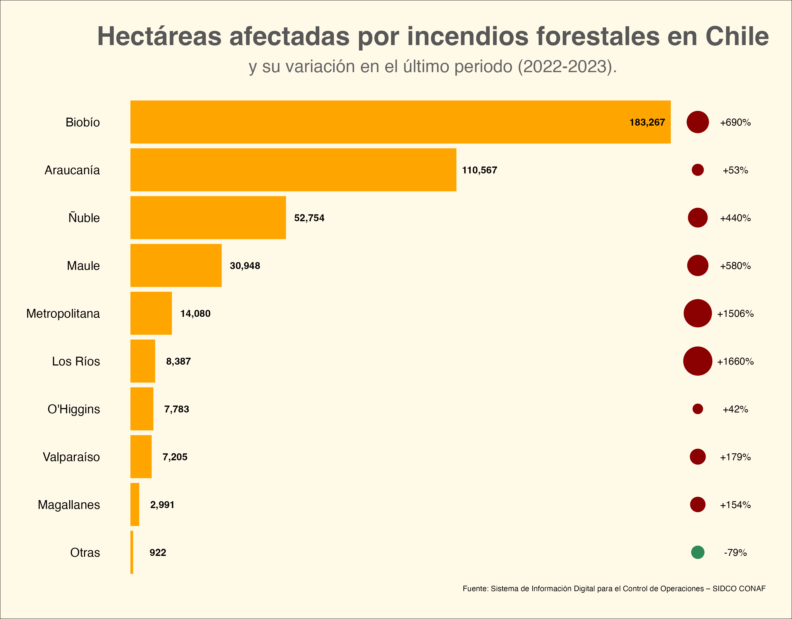

### Día 4: Historical 

Este tipo de gráficos permiten mostrar datos de secuencias históricas. Seguimos en la demografía mostrando datos respecto a la caída de matrimonios en Chile en comparación con otros países a lo largo del tiempo.

- Datos para la elaboración del gráfico disponibles [aquí](https://ourworldindata.org/marriages-and-divorces)
- Código disponible [aquí](/R/04-historical.R)

Autoría Cristina Marchant.

### Día 5: Slopes 

Este tipo de gráficos permiten mostrar variaciones a través de los años. El día de hoy nos centramos en el cambio que ha tenido la percepción del aborto en Chile en los últimos ocho años.

- Datos para la elaboración del gráfico disponibles [aquí](/input/Datos_aborto_bicentenario.xlsx)
- Código disponible [aquí](/R/05-slopes.R)

Autoría Jonatan Salazar.

### Día 6: Data day OWID 

Este día era el último de la serie de "distributions", y correspondía a un gráfico con datos de Our World in Data [OWID](https://ourworldindata.org/)  

- Datos para la elaboración del gráfico disponibles [aquí](https://ourworldindata.org/migration)
- Código disponible [aquí](/R/06-data-day-OWID.R)

Autoría Vicky Rojas.

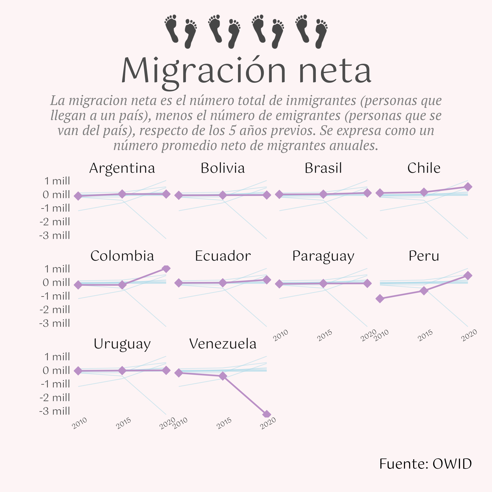

### Día 7: Hazards 

Hoy empezaban los gráficos de distribuciones, sin embargo, nos quedamos atrás. Pero tomamos en consideración la idea de "riesgos", para graficar los casos policiales entre 2021 y 2022. 

- Datos para la elaboración del gráfico disponibles [aquí](http://cead.spd.gov.cl/wp-content/uploads/file-manager/Presentaci%C3%B3n-Estad%C3%ADsticas-anual-2022.pdf)
- Código disponible [aquí](/R/07-hazards.R)

Autoría Vicky Rojas.

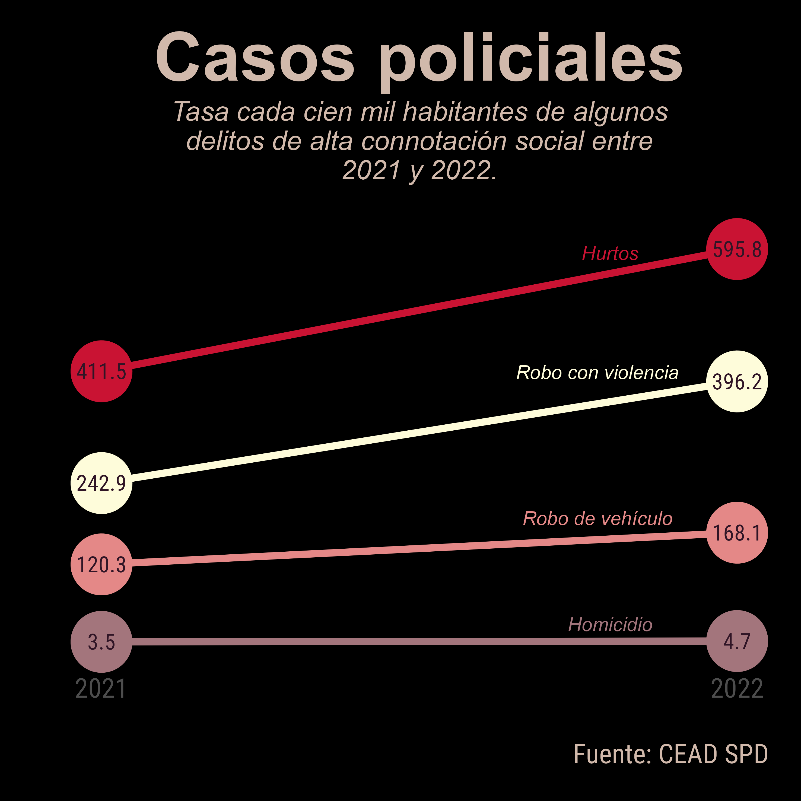

### Día 8: Humans

Hoy continuamos con el tema "humanos" y el tipo de gráfico de distribuciones.  

- Datos para la elaboración del gráfico disponibles [aquí](https://ourworldindata.org/future-population-growth)
- Código disponible [aquí](/R/08-humans.R)

Autoría Cristina Marchant.

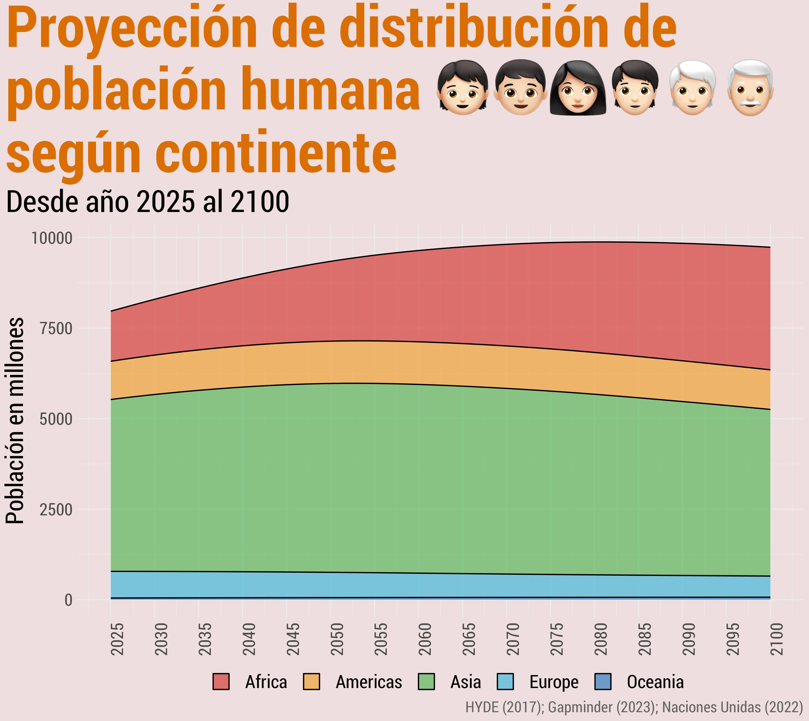

### Día 10: Híbrido

Este gráfico utiliza la librería `tuber` que nos permite descargar la información de canales y playlist de YouTube. Con esta información, construímos un gráfico que muestra el número de visitas/reproducciones que hay en el canal de NewJeans y los videos de **NewJeans** en el canal de HYBE LABELS. Dejando aquellos videos con más de 10M de reproducciones, es posible observar los videos más visitados de este nuevo grupo de kpop. El concepto híbrido se pensó en la combinación de `ggplot2` e imágenes en png.

- Código disponible [aquí](/R/10-híbrido.R)

Autoría Soledad Araya.

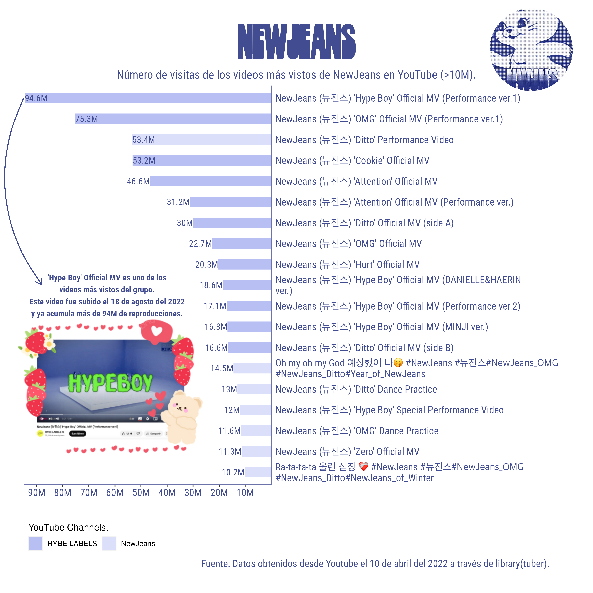

### Día 12: Theme day: BBC News

Para este día se trabajó con datos obtenidos a partir del trabajo con el paquete spotifyr. Acá pueden encontrar un tutorial: https://www.rcharlie.com/spotifyr/

- Código disponible [aquí](/R/12-bbc_news.R)

Autoría Cristina Marchant.

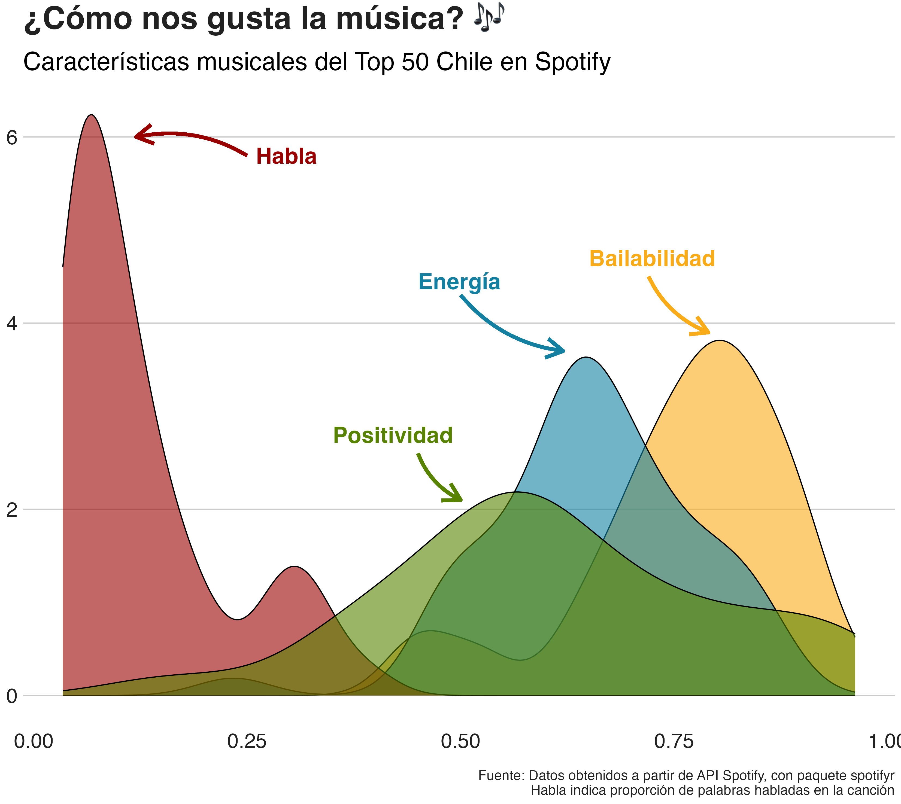

### Día 13: Cultura pop

Los servicios de streaming ya se volvieron parte de nuestra vida, por lo que nunca está de más ver qué es lo que nos están ofreciendo. Con datos extraídos desde IMDB de las series de Netflix, Primevideo, HBO Max y Apple TV, este gráfico muestra las series mejor evaluadas por año de cada servicio de streaming desde el 2000, y su relación con las audiencias: en el eje y tenemos el número de evaluaciones que recibió cada uno de estas series. Breaking Bad y Game of Thrones aparecen como las grandes ganadoras de las audiencias.

- Código disponible [aquí](/R/13-pop_cultureo.R)

Autoría Soledad Araya.

Si quieres ver cuál es la serie mejor evaluada por año, lo puedes ver en el siguiente gráfico:

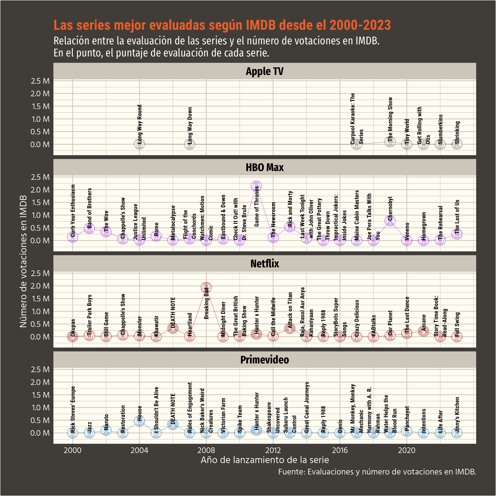

### Día 15: Positivo/Negativo

Para el tema de este día se utilizó una base de datos de Goodreads, una red social usada para compartir información, gustos y listas de los libros que tienes en mente. En este caso, se ocuparon sólo las primeras 25 observaciones con el objetivo de ver cómo se distribuye las estrellas (positivas, negativas, ni lo uno ni lo otro) en este conjunto de libros.

- Código disponible [aquí](/R/15-positive_negative.R)

Autoría de Soledad Araya.

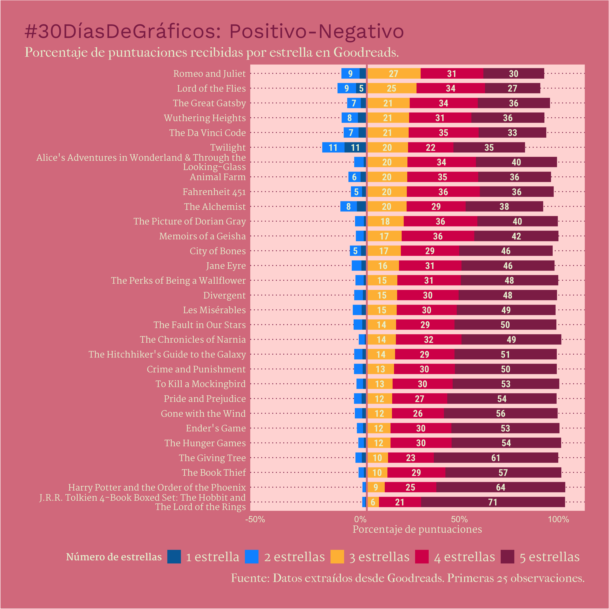

### Día 16: Familia 

Para el tema de "familia" se utilizaron datos de la Encuesta CASEN (1990-2010) para ver los cambios en las jefaturas de hogar por género. 

- Código disponible [aquí](/R/16-family.R)

Autoría Josefa Guerra.

### Día 17: Networks

El análisis de redes nos permite, a grandes rasgos, identificar las relaciones sociales entre individuos. Para el día de hoy nos centramos en John Coltrane, un destacado músico de jazz. El gráfico refleja los cuarenta músicos con quienes más colaboró a lo largo de su carrera musical (además de las relaciones entre los mismos). Destaca su colaboración con Miles Davis, Thelonious Monk y sus iniciones musicales con Dizzy Gillespie.

- Código disponible [aquí](/R/17-networks.R)

Autoría Jonatan Salazar.

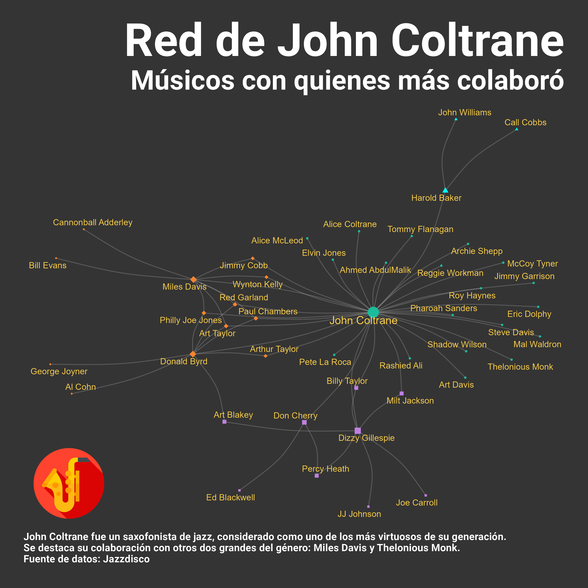

### Día 20: Correlation

Para el día hoy tenemos correlaciones, las cuales nos permiten establecer relaciones entre variables. En este caso observamos la relación entre el Indice de Desarrollo Humano y el PIB percápita de los países Sudamericanos. El gráfico logra reflejar cierta correlación directamente proporcional entre las variables (r Pearson = 0.77).

- Código disponible [aquí](/R/20-correlation.R)

Autoría Jonatan Salazar.

